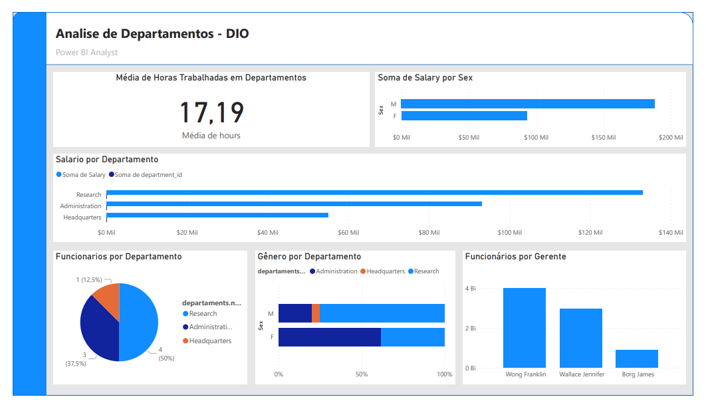

# Analise de Dados de Colaboradores com Power BI - Desafio DIO

Este projeto analisa dados de colaboradores de uma empresa. O objetivo é obter insights sobre a força de trabalho e tomar decisões estratégicas.

## **Metodologia:**

Organização dos dados: As tabelas foram organizadas em arquivos JSON.
Importação para o Power BI: As tabelas JSON foram importadas para o Power BI.
Limpeza e mesclagem de dados: Os dados sofreram conexões de relacionamento entre tabelas, foram limpos e mesclados para criar um conjunto de dados completo.
Criação de relatório: Um relatório foi criado para responder perguntas específicas sobre os dados.

## **Resultados:**

Média de horas trabalhadas: A média de horas trabalhadas varia entre os departamentos então pegamos a média geral.
Salário por departamento: O salário médio varia entre os departamentos.
Funcionários por departamento: O número de funcionários por departamento é diferente.
Gênero por departamento: A distribuição de gênero varia entre os departamentos.
Salário por gênero: Existe uma diferença de salário entre homens e mulheres.
Funcionários por gerente: O número de funcionários por gerente é diferente.

## **Tecnologias:**

- Power BI Desktop

## **Arquivos:**

* **Analise de departamento.pbix:** Relatório do Power BI;
* **Analise de departamento.pdf:** Relatório em PDF.
* **BancoDados (Pasta):** Base de Dados com os jsons.

## **Imagens:**

## Banco de dados de jsons antes das limpezas de dados e mesclagens

  

## Banco de dados de jsons depois das limpezas de dados e mesclagens

  

## Relatório final após analise de dados

  

## **Links:**

**Github do desafio:** [https://github.com/julianazanelatto/power_bi_analyst](https://github.com/julianazanelatto/power_bi_analyst)

## **Instruções:**

1. Baixe o arquivo `Analise de departamento.pbix` e abra-o no Power BI Desktop.
2. Leia o relatório em PDF (`Analise de departamento.pdf`) para obter mais informações sobre as análises realizadas.

