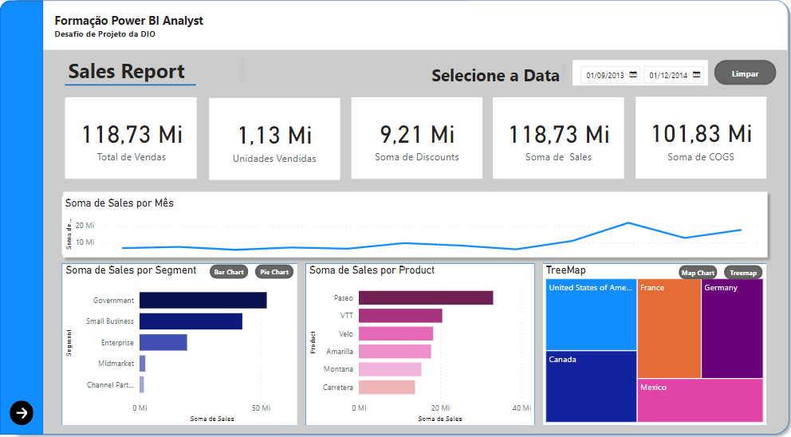

# Relatório de Vendas Elegante com Power BI - Desafio DIO

Este repositório contém o relatório Power BI desenvolvido para o desafio da DIO. O relatório é baseado na sample financials do Power BI e inclui:

* Estrutura definida com navegação por botões;
* Segmentadores de dados e botões com imagens;
* Indicadores e botões para selecionar diferentes visuais sobre um mesmo assunto;
* Segunda página com análises adicionais;
* Publicação no Power BI Service.

## **Tecnologias:**

- Power BI Desktop

## **Arquivos:**

* **Projeto_Dio.pbix:** Relatório do Power BI;
* **Projeto_Dio.pdf:** Relatório em PDF.
* **Financial Sample.xlsx:** Base de Dados.

## **Imagens:**

  

## **Links:**

**Github do desafio:** [https://github.com/julianazanelatto/power_bi_analyst](https://github.com/julianazanelatto/power_bi_analyst)

## **Instruções:**

1. Baixe o arquivo `Projeto_Dio.pbix` e abra-o no Power BI Desktop.
2. Explore o relatório e interaja com os diferentes elementos.
3. Leia o relatório em PDF (`Projeto_Dio.pdf`) para obter mais informações sobre as análises realizadas.

